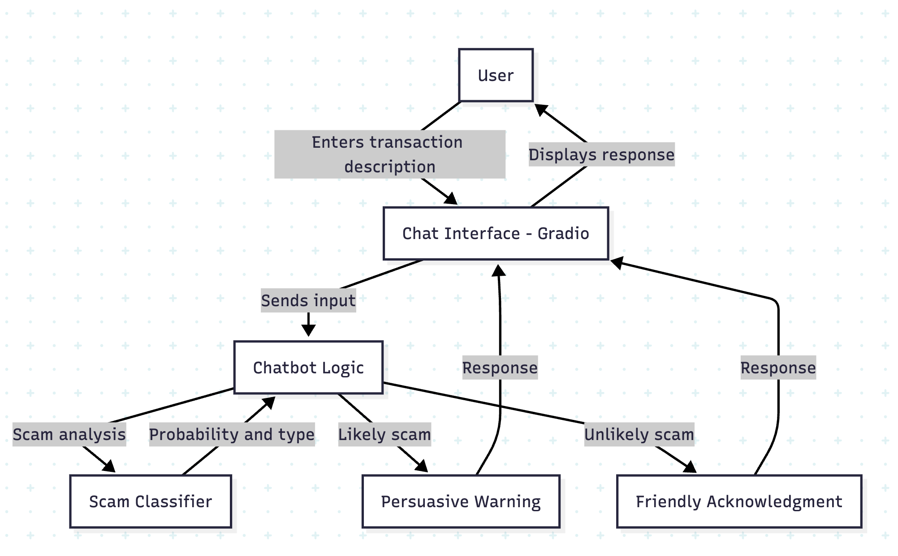

Money Transfer Scam Detector
Overview
This Python-based chatbot, built with Gradio, helps users identify potential scams in money transfer requests. It analyzes descriptions to classify the type of scam (e.g., phishing, advance fee) and provides a scam likelihood score. If a scam is detected (score above 50), the bot uses ethical persuasion to convince the user not to proceed. A prompt file (prompts.py) defines the chatbot's behavior and tone.
Features

User-Friendly Interface: Gradio chat interface for seamless interaction.
Scam Type Classification: Identifies scam types like phishing, advance fee, investment, romance, or impersonation.
Scoring System: Assigns a scam likelihood score (0-100) based on keyword matches and heuristics.
Persuasive Warnings: Uses ethical persuasion (e.g., social proof, risk highlighting) to convince users to avoid risky transactions.
Prompt-Driven: Behavior is guided by prompts in prompts.py for consistency and clarity.
Educational: Offers safety tips for low-risk cases.

Installation

Clone the Repository:
git clone <repository-url>

Run the Application:Launch the Gradio interface:
python scam_detector.py

Usage

Launch the application using the command above.
Access the Gradio interface in your web browser (URL provided in the terminal).
Enter a description of the money transfer request in the chat window.
The bot will:
Classify the scam type and provide a likelihood score.
If the score is high (>50), it will strongly persuade you to stop the transaction with reasons and alternatives.
If the score is low, it will offer general safety advice.

Example Inputs

"Someone emailed me saying I won $1,000,000 and need to send $500 to claim it."

"My friend asked me to send $200 via PayPal for an emergency."

"A person claiming to be a prince needs my bank account to transfer millions."

Architecture
The application follows a modular design:

Gradio Chat Interface: Handles user input and displays responses.
Chatbot Response Function: Manages conversation flow and generates persuasive responses.
Scam Type Classifier: Matches text against scam type keywords to identify and score potential scams.
Scam Types Database: Stores predefined scam types and their associated keywords.

See architecture.mmd for a visual representation (use a Mermaid-compatible viewer).

Prompts
The chatbot's behavior is defined by prompts in prompts.py, stored as Python string variables:

SYSTEM_PROMPT: Sets the chatbot’s role, tone, and objectives.
INITIAL_GREETING_PROMPT: Engages users and requests details.
FOLLOW_UP_PROMPT: Handles vague inputs.
SCAM_DETECTION_PROMPT: Guides scam type classification and scoring.
HIGH_RISK_RESPONSE_PROMPT: Crafts persuasive warnings for likely scams.
LOW_RISK_RESPONSE_PROMPT: Provides cautious advice for low-risk cases.
PERSUASION_GUIDELINES_PROMPT: Ensures ethical persuasion techniques.

Limitations

Relies on keyword-based classification, which may miss sophisticated scams.
False positives/negatives are possible; users should verify requests independently.
No external API or machine learning model is used, limiting advanced analysis.

Future Improvements

Build a adversary llm that will generate more sophisticated scam requests to improve detection.
describe a score creterion for the bot to use in its responses - does it successfully convince the user to stop the transaction?

More options for the classifier - 
here I used the OneClassSVM as anomaly detector - the anomaly in our case is a non-scam description for a transaction.
but we can also build a cascade of experts that can detect a type of scam and aggregate the results for the final decision OR create a synthetic data using LLM for a binary classification task.

trail and error - 
while building the classifier I tried traditional methods like word2vec and tf-idf, eventually I used BERT since the tf-idf was too sparse and I know BERT to be good at embedding text like that, i have used finBert in the past and got good results.
the classifier is not perfect to say the least, but its an exploration of an idea that i had 

